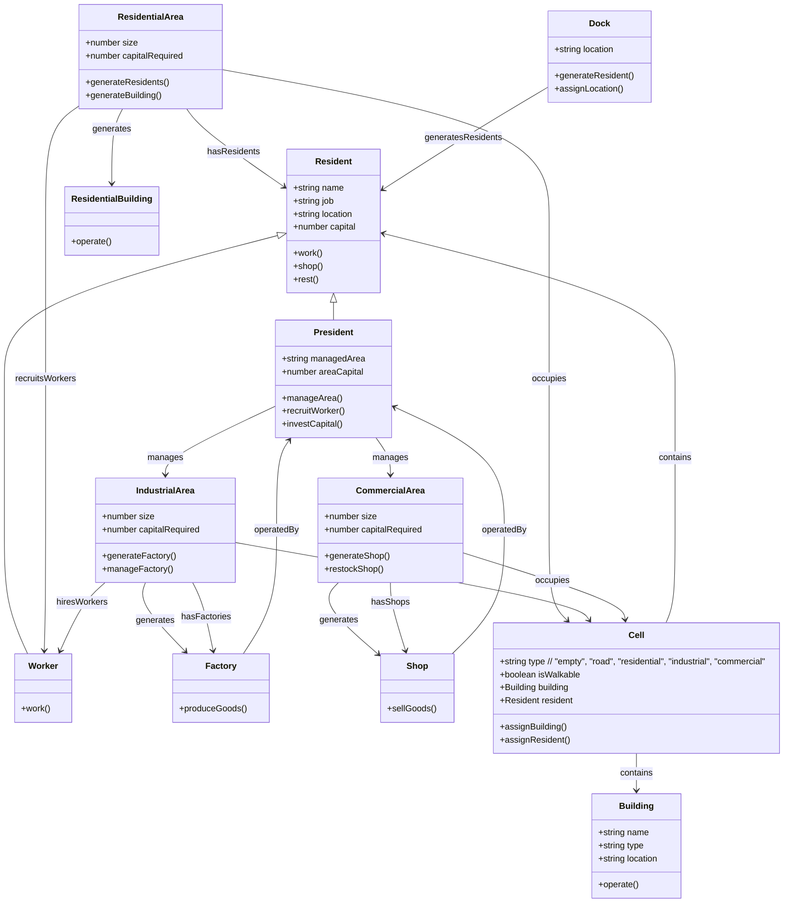

為了做一個模擬程式類型的小遊戲來練習物件導向設計，畫了許多規格與流程，再丟進 ChatGPT 請他產生規格。
跟 ChatGPT 吵了一番，應該可以依此為規格書開始實作了。

##  **MVP 規格說明**

**遊戲目標：**  
玩家在這個城市模擬遊戲中，將透過鋪設道路和建設不同的區域（住宅區、工業區、商業區）來建設和發展城市。居民會根據需求自動移動並執行工作或購物等行為，並利用 Dijkstra 演算法來計算最短的行走路徑。

---

#### **遊戲過程與玩家互動**

1. **遊戲開始：**
    
    - 當遊戲開始，玩家會看到一個空白的 10x10 地圖，地圖中會有部分道路與空地。
        
    - 玩家首先會看到建設選單，可以選擇開始進行城市建設。
        
2. **玩家互動：**
    
    - **鋪設道路：**  
        玩家可以選擇道路工具，並點擊空地來鋪設道路。這些道路將成為居民可以行走的地方。
        
    - **建設區域（住宅區、工業區、商業區）：**  
        玩家可以選擇不同的空地規格來建設不同的區域。
        
    - **選擇建築：**  
        玩家可以點擊已建設的區域來管理建築物，查看其狀態，或進行升級、拆除等操作。（目前沒有升級、拆除的功能）
        
3. **自動執行的系統：**
    
    - **建築物自動生成：**
        
        - 每 10 秒，住宅區會自動生成一棟房子。
            
        - 每 10 秒，工業區會自動生成食品工廠。
            
        - 每 10 秒，商業區會自動生成商店。
            
    - **居民生成與行為：**
        
        - 每 10 秒，住宅區會自動生成一名新居民。
            
        - 居民根據需求自動前往工廠（工作）或商店（購物）。
            
        - 使用 **Dijkstra 演算法** 計算最短的行走路徑，幫助居民選擇最短的行走路線。
            
    - **自動經濟流動：**
        
        - 當居民在商店購物或工廠生產時，資金會自動流動。商店會從工廠進行補貨，並將商品銷售給居民。
            
        - 工廠會根據需求生產食物，商店會根據庫存狀況向工廠叫貨。
            
4. **遊戲循環：**
    
    - 每秒遊戲時間會進行更新，並觸發建築物生成、居民移動等自動行為。
        
    - 每 10 秒鐘，遊戲會自動進行以下更新：
        
        - 生成新居民。(如果住宅區還有空位)
            
        - 更新建築物狀態（例如，工廠進行生產）。
            
        - 更新居民行為（工作、購物等）。
            
        - 處理資金流動（商品購買、工廠生產等）。
            

---

#### **玩家互動 vs 自動行為**

1. **玩家互動：**
    
    - **鋪設道路：** 玩家可以自由鋪設道路，並確保道路網絡連接。
        
    - **建設區域：** 玩家可以選擇不同的空地規格來建設不同的區域。
                
2. **自動行為：**
    
    - **建築物生成：** 每 10 秒，住宅區會自動生成房子，工業區會生成工廠，商業區會生成商店。
        
    - **居民行為：** 每 10 秒，會生成一名新居民，居民會根據需求自動尋找工作（前往工業區）或購物（前往商業區）。
        
    - **經濟流動：** 商店會與工廠進行補貨，並向居民銷售商品。工廠會自動生產食物並提供給商店。
        

---

#### **遊戲流程**

1. **遊戲開始：**
    
    - 顯示空白的 10x10 地圖，並提供選單來進行建設。
        
2. **建設道路與區域：**
    
    - 玩家選擇鋪設道路，然後選擇放置建築物區域（住宅、工業、商業）。
        
3. **自動生成建築物：**
    
    - 每 10 秒，自動生成新的建築物（住宅、工廠、商店）。
        
4. **居民生成與行為：**
    
    - 每 10 秒生成新的居民，並根據需求自動前往工廠或商店。
        
    - 居民會利用 Dijkstra 演算法計算最短的行走路徑。
        
5. **經濟流動：**
    
    - 商店會與工廠進行商品補充，並銷售給居民。
        
    - 工廠會生產食物並賣給商店。
        
6. **持續循環：**
    
    - 遊戲會每秒更新，並自動進行建築物、居民行為和經濟活動的更新。
        

---

#### **功能概覽：**

1. **地圖與道路系統：**
    
    - 玩家可以鋪設道路，讓居民能夠在地圖上行走。
        
2. **區域建設：**
    
    - 玩家可選擇建設不同類型的區域（住宅區、工業區、商業區），並放置建築物。
        
3. **自動建設與居民生成：**
    
    - 住宅區每 10 秒生成房子。
        
    - 工業區每 10 秒生成食品工廠，商業區每 10 秒生成商店。
        
    - 每 10 秒生成一名居民，並根據需求執行相應行為。
        
4. **Dijkstra 演算法：**
    
    - 用於計算居民從起點到目的地的最短行走路徑。
        
5. **遊戲循環與自動化：**
    
    - 遊戲每秒進行一次更新，並根據時間推進更新建築物、居民行為、經濟流動等。

```markdown
| 角色     | 職業   | 行為描述                                          | 收入描述                                      | 成本描述                                                       |
| -------- | ------ | ------------------------------------------------- | --------------------------------------------- | ------------------------------------------------------------ |
| **居民** | 工廠工人 | - 在工廠工作，生產食物。                            | - 工資收入：每次工作得到工廠支付的工資（如：1元/次）  | - 無                                                        |
| **居民** | 商店員工 | - 在商店工作，賣商品。                             | - 工資收入：每次工作得到商店支付的工資（如：1元/次）  | - 無                                                        |
| **居民** | 購物者  | - 逛商店購買物品。                                 | - 無                                          | - 購物開銷：每次購買商品消耗金錢（如：2元/份飯）            |
| **居民** | 休息者  | - 在家休息，停止行動                               | - 無                                          | - 無                                                        |
| **居民** | 送貨員  | - 從工廠或商店將商品送到目的地。                   | - 送貨收入：每次送貨可賺取固定金額（如：5元/單）     | - 無                                                        |
| **居民** | 社長   | - 監督公司運營。                                  | - 10% 公司的利潤回報：例如，工廠賺 100 元，社長獲得 10 元 | - 資本投入：社長初期投入資金（例如：投資 100 元）           |
| **法人** | 工廠   | - 生產食品。                                      | - 生產收入：賣給商店食物（如：每份飯賣 5 元）   | - 物料成本：生產過程中需要消耗資源（如：1元/份飯）- 工人工資：每次支付給工人的工資（如：1元/次） |
| **法人** | 商店   | - 賣商品（飯）。                                  | - 銷售收入：從居民那裡賣飯或商品（如：每份飯賣 5 元）  | - 進貨成本：購買食物和商品的支出（如：每份飯進貨 2 元）- 店員工資：支付員工工資（如：1元/次） |
```

---

```text
+-----------------+         +-----------------+         +-----------------+
|     居民        |         |    法人         |         |    法人         |
|-----------------|         |-----------------|         |-----------------|
| - 工廠工人      |----+--->| - 工廠          |<----+-->| - 商店          |
| - 商店員工      |         | - 生產食物      |         | - 賣商品        |
| - 購物者        |         | - 招聘工人      |         | - 招聘員工      |
| - 休息者        |         +-----------------+         +-----------------+
| - 送貨員        |                 ↑                        ↑
| - 社長          |                 |                        |
+-----------------+                 |                        |
         |                          |                        |
         |                          |                        |
  +------v------+         +---------+---------+        +-----+------+
  |    工資     |         |    生產收入       |        |  進貨成本   |
  |    收入     |         |    社長回報       |        |  銷售收入   |
  |             |         |    支付工人工資   |        |  支付員工工資|
  +-------------+         +------------------+        +-------------+
         |                                      
         | 
+--------v--------+                                      
| 購物開銷：消費支出 |                                      
+------------------+                                      
         |
         |  
+--------v--------+
| 送貨收入：固定金額 |
+------------------+

```


## **任務拆分：基於遊戲流程的設計與實作**

1. **住宅區** 生成後會有居民進駐，並且居民會從 **碼頭** 進來。
2. **居民行為**：居民會根據需求選擇工作、購物或休息。

---

### **第一天：地圖搭建與基本交互實現**

#### **任務 1: 地圖與道路系統實現**

**目標：**  
構建一個 10x10 的遊戲地圖，並且支持玩家鋪設道路。

**具體步驟：**

1. 創建 10x10 的格子地圖。
    
2. 為每個格子設置類型屬性（`empty`、`road`、`residential`、`industrial`、`commercial` 等）。
    
3. 讓玩家選擇鋪設道路並顯示到地圖中，鋪設的道路將成為可行走的區域。
    

**技術要求：**

- 使用 **Vue 3 的 `v-for`** 動態顯示地圖格子。
    
- 使用 **`reactive`** 管理地圖格子的狀態。
    
- 基本的交互邏輯，讓玩家點擊來鋪設道路。

**規格：**

- 有道路或建築物的格子才可以行走

---

#### **任務 2: 建築區域放置**

**目標：**  
實現玩家放置 **住宅區**、**工業區** 和 **商業區** 的功能。

**具體步驟：**

1. 玩家選擇建築區域（住宅區、工業區、商業區），並在地圖上選擇一個區域來放置建築。
    
2. 生成的建築物會顯示在相應的區域中，並標記為建設完成。
    

**技術要求：**

- 用 **Vue 3** 和 **`v-bind`** 來綁定動態顯示區域。
    
- 設計建築物放置和顯示邏輯，確保區域正確顯示。
    

---

### **第二天：居民與行為系統**

#### **任務 3: 居民進駐邏輯**

**目標：**  
當有 **住宅區** 建設完成時，會有居民從 **碼頭** 進駐到相應位置。

**具體步驟：**

1. 當 **住宅區** 放置完成時，每 10 秒會生成一名居民，並將其放置在住宅區。
    
2. 居民會從 **碼頭** （假設座標是 `(0,0)`）開始，依次沿著道路行走，最終到達指定住宅區。
    
3. 設計一個簡單的 **Dijkstra 演算法** 來計算居民的最短路徑，從 **碼頭** 到 **住宅區** 的最短路徑。
    

**技術要求：**

- 讓每個住宅區有一個 **居民列表**。
    
- 居民自動從 **碼頭** 移動到住宅區，使用 **Dijkstra** 演算法來計算路徑。
    
- 使用 **`reactive`** 和 **`setInterval`** 每 10 秒生成新居民。
    

---

#### **任務 4: 居民的自動行為（工作、購物、休息）**

**目標：**  
讓居民能夠根據需求自動選擇行為（工作、購物、休息）。

**具體步驟：**

1. 每位居民有一個 **行為狀態**（例如，`工作中`、`購物中`、`休息中`）。
    
2. 居民會根據需求自動選擇工作、購物或休息。
    
    - **工作**：居民會前往 **工業區** 或 **商業區**，並根據需求執行工作（如工廠生產、商店銷售）。
        
    - **購物**：居民會前往 **商業區** 進行購物。
        
    - **休息**：居民會回到住宅區，停止所有活動。
        

**技術要求：**

- 為每個居民設置 **`wantToDo`** 屬性來記錄居民想做的事。
    
- 使用 **`setInterval`** 每秒更新居民的行為狀態，並讓居民根據當前狀態執行行動。
    

---

### **第三天：商店、工廠與經濟系統**

#### **任務 5: 建築物自動運營（工廠與商店）**

**目標：**  
讓 **工廠** 和 **商店** 自動運營，並根據需求生產食物或銷售商品。

**具體步驟：**

1. 每 10 秒自動生成 **工廠** 或 **商店**，並開始運作。
    
2. 工廠會生產食物，商店會銷售商品。
    
3. 當商店庫存不足時，商店會向工廠訂購商品。
    

**技術要求：**

- 使用 **`setInterval`** 來實現自動生產和銷售。
    
- 管理工廠和商店的庫存，並根據庫存情況進行自動補貨。
    

---

#### **任務 6: 經濟系統與資金流動**

**目標：**  
實現遊戲中的經濟流動，讓商店和工廠之間的資金流動能夠自動進行。

**具體步驟：**

1. 當居民購物時，從商店賺取收入，並將該金額流動到工廠進行商品補貨。
    
2. 當工廠生產後，會根據產品銷售給商店進行收入分配。
    
3. 社長會根據公司運營的利潤獲得 10% 的回報。
    

**技術要求：**

- 使用 **`reactive`** 更新每個角色的資金狀態。
    
- 設計經濟流動邏輯，確保資金從商店流向工廠，並根據利潤分配給社長。
    

---

### **總結與玩家遊玩流程**

1. **第一天：** 玩家開始遊戲，並能夠鋪設道路、放置建築區域。
    
    - 玩家可以放置住宅區、工業區和商業區。
        
2. **第二天：** 當住宅區建設完成，居民會從碼頭進駐，並自動選擇工作、購物或休息。
    
    - 社長角色會由最富有的居民自動轉化為社長，開始管理工廠或商店。
        
3. **第三天：** 商店與工廠開始自動運營，並且居民進行購物、工作等活動。
    
    - 經濟系統確保資金流動，社長獲得利潤回報。
        


## 物件設計

#### **0. Cell**

Cell 類別在遊戲中扮演著非常重要的角色，因為它不僅負責地圖的格子管理，還負責承載建築物和居民。每個 Cell 類別可以有以下功能：

- 設置格子的類型和可行走狀態。
- 可以將建築物或居民分配到格子中，並在遊戲中根據這些元素進行更新。
- 當居民移動或建築物建設完成時，對應的格子會更新，這樣可以動態管理遊戲狀態。

```typescript

class Cell {
  type: string;
  isWalkable: boolean;
  building: Building | null;
  resident: Resident | null;

  constructor(type: string) {
    this.type = type;
    this.isWalkable = type === "road" || type === "empty";
    this.building = null;
    this.resident = null;
  }

  assignBuilding(building: Building) {
    this.building = building;
    this.isWalkable = true;  // 建築物會佔據格子並使其可行走
  }

  assignResident(resident: Resident) {
    this.resident = resident;
  }
}
```

#### **1. 區域（Area）**

區域（住宅區、工業區、商業區等）應該有一個基礎類別，可以作為其他具體區域的父類別，並提供共享屬性和行為。

```typescript
class Area {
  name: string;
  size: number;
  capitalRequired: number;
  residents: Resident[]; // 居民列表
  buildings: Building[]; // 建築物列表

  constructor(name: string, size: number, capitalRequired: number) {
    this.name = name;
    this.size = size;
    this.capitalRequired = capitalRequired;
    this.residents = [];
    this.buildings = [];
  }

  // 添加居民到區域
  addResident(resident: Resident) {
    this.residents.push(resident);
  }

  // 添加建築物
  addBuilding(building: Building) {
    this.buildings.push(building);
  }
}

// 住宅區
class ResidentialArea extends Area {
  constructor(size: number, capitalRequired: number) {
    super("Residential", size, capitalRequired);
  }
}

// 工業區
class IndustrialArea extends Area {
  constructor(size: number, capitalRequired: number) {
    super("Industrial", size, capitalRequired);
  }
}

// 商業區
class CommercialArea extends Area {
  constructor(size: number, capitalRequired: number) {
    super("Commercial", size, capitalRequired);
  }
}
```

---

#### **2. 建築物（Building）**

每個建築物都應該擁有基本屬性，並且可以通過繼承來創建不同類型的建築物（例如：住宅、工廠、商店）。

```typescript
class Building {
  name: string;
  type: string;
  location: string;

  constructor(name: string, type: string, location: string) {
    this.name = name;
    this.type = type;
    this.location = location;
  }

  // 每個建築物可能會有特定功能
  operate() {
    console.log(`${this.name} is operating.`);
  }
}

// 住宅
class ResidentialBuilding extends Building {
  constructor(name: string, location: string) {
    super(name, "Residential", location);
  }
}

// 工廠
class Factory extends Building {
  constructor(name: string, location: string) {
    super(name, "Factory", location);
  }

  produceGoods() {
    console.log(`${this.name} is producing goods.`);
  }
}

// 商店
class Shop extends Building {
  constructor(name: string, location: string) {
    super(name, "Shop", location);
  }

  sellGoods() {
    console.log(`${this.name} is selling goods.`);
  }
}
```

---

#### **3. 居民（Resident）**

居民類別應該具備 **職業（Job）** 屬性，並且能夠根據其職業進行特定的行為（如工作、購物、休息等）。每位居民會有對應的工作或需求行為，並且他們的職業與所屬建築物（如工廠或商店）有關聯。

```typescript
class Resident {
  name: string;
  job: string;
  location: string;
  capital: number;

  constructor(name: string, job: string, location: string, capital: number) {
    this.name = name;
    this.job = job;
    this.location = location;
    this.capital = capital;
  }

  // 居民行為：工作
  work() {
    if (this.job === "Worker") {
      console.log(`${this.name} is working at the factory.`);
    } else if (this.job === "Shopkeeper") {
      console.log(`${this.name} is working at the shop.`);
    }
  }

  // 居民行為：購物
  shop() {
    console.log(`${this.name} is shopping at the shop.`);
  }

  // 居民行為：休息
  rest() {
    console.log(`${this.name} is resting at home.`);
  }
}

// 具體職業的居民
class Worker extends Resident {
  constructor(name: string, location: string, capital: number) {
    super(name, "Worker", location, capital);
  }
}

class Shopkeeper extends Resident {
  constructor(name: string, location: string, capital: number) {
    super(name, "Shopkeeper", location, capital);
  }
}
```

---

#### **4. 城市總體人口與經濟指數**

城市的人口和經濟指數可以根據 **居民數量** 和 **各區域經濟運營情況** 來計算。這些指數將幫助玩家了解整個城市的發展狀況。

```typescript
class City {
  areas: Area[]; // 城市擁有的區域
  residents: Resident[]; // 城市的居民

  constructor() {
    this.areas = [];
    this.residents = [];
  }

  // 添加區域
  addArea(area: Area) {
    this.areas.push(area);
  }

  // 添加居民
  addResident(resident: Resident) {
    this.residents.push(resident);
  }

  // 計算人口數量
  getPopulation() {
    return this.residents.length;
  }

  // 計算經濟指數（簡單示例：通過各區域的資本需求和居民數量來計算）
  getEconomicIndex() {
    let totalCapital = 0;
    this.areas.forEach(area => {
      totalCapital += area.capitalRequired;
    });

    return totalCapital / this.residents.length;
  }

  // 顯示城市狀況
  showCityStats() {
    console.log(`City Population: ${this.getPopulation()}`);
    console.log(`City Economic Index: ${this.getEconomicIndex()}`);
  }
}
```

---

### **整體邏輯與流程概述：**

1. **區域管理：**
    
    - 城市中有 **住宅區**、**工業區** 和 **商業區**，每個區域具有共享屬性，如大小、所需資本、居民與建築物。
        
    - 每個區域都能夠自動生成建築物並且管理居民，根據區域不同，會生成相應類型的建築（如工廠或商店）。
        
2. **居民與職業：**
    
    - 居民有不同的職業（如工人、商店員工），並根據其職業來執行對應的行為（如工作、購物、休息）。
        
    - 每個居民會根據其職業進行自動行為，並根據需求選擇工作、購物或休息。
        
3. **經濟與資本流動：**
    
    - **工廠** 和 **商店** 會自動生產商品並賺取收入，商店會銷售商品，工廠會向商店提供商品。
        
    - **社長** 會根據公司的運營情況獲得 10% 的利潤回報。
        
    - 城市的經濟指數會根據區域的資本需求與居民數量來計算。
        
4. **人口與經濟指數：**
    
    - **城市人口** 根據居民數量計算。
        
    - **經濟指數** 基於各區域的資本需求與居民數量進行計算，幫助玩家了解城市的經濟狀況。
        

---

### **技術實踐建議**

1. **使用 Vue 3 的反應式系統：**
    
    - 使用 Vue 3 的 **Composition API** (`reactive` 和 `ref`) 來管理遊戲狀態，例如居民的狀態、建築物的狀態、區域的運營情況。
        
    - 每當居民或建築物的狀態發生變化時，Vue 會自動更新 UI，使遊戲畫面保持同步。
        
2. **Dijkstra 演算法：**
    
    - 用於計算居民從 **碼頭** 到 **住宅區**、**工廠** 或 **商店** 等目標地點的最短路徑。
        
    - Dijkstra 演算法可以幫助遊戲中居民的移動更加智能和高效。
        
3. **經濟系統：**
    
    - 經濟流動模型應該與遊戲的區域、建築物、居民之間進行良好的協作。
        
    - 當居民購物時，商店獲得收入並支付工廠，工廠則生產商品並向商店供貨。
        
4. **持續更新：**
    
    - 使用 `setInterval` 或 `requestAnimationFrame` 來定期更新遊戲中的各種狀態（如居民行為、建築物生成、資金流動等）。
        


---

### **總結**

- **區域與建築物繼承：** 住宅區、工業區、商業區繼承自基礎的 **Area** 類別，並擁有特定的屬性和方法來管理居民與建築。
    
- **居民與職業：** 居民具有不同的職業，每個職業有其特定的行為（如工作、購物、休息）。
    
- **經濟系統與城市指數：** 城市會根據人口和區域的資本需求計算經濟指數，並確保資金流動順暢。
    

